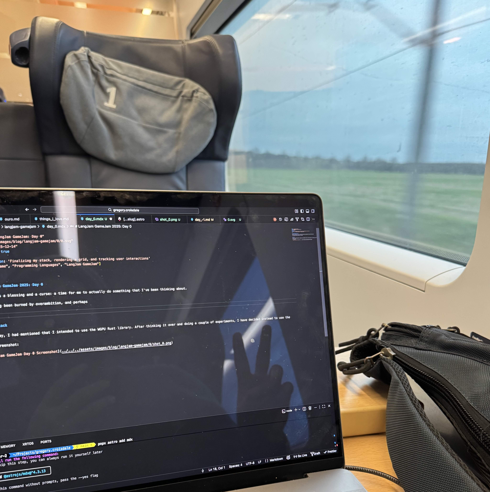
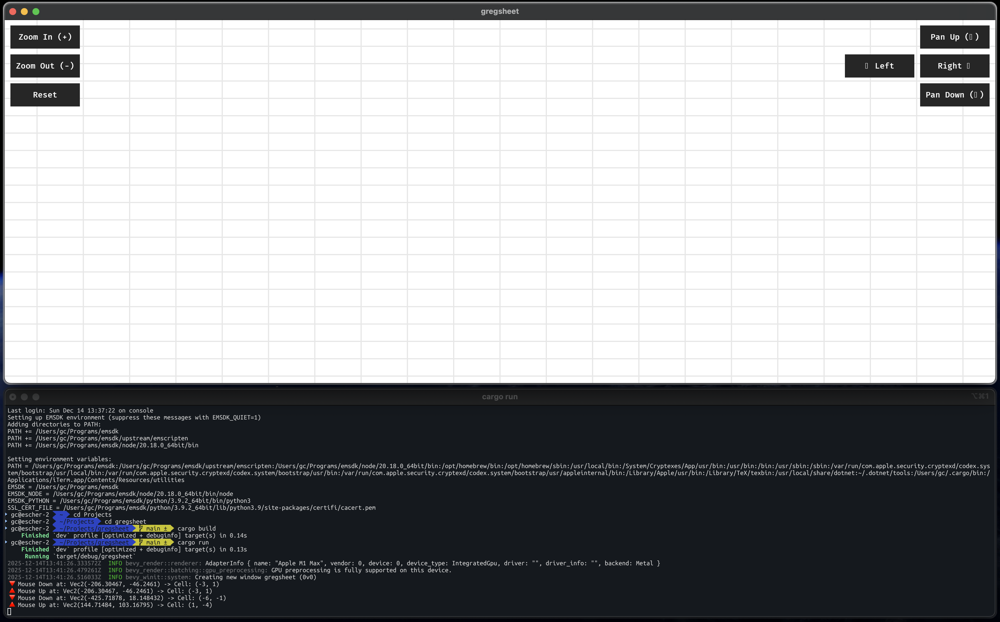
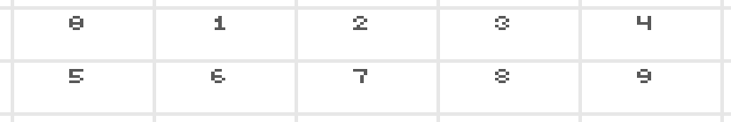
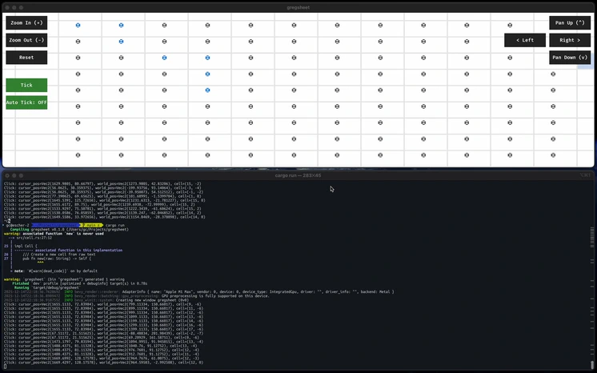

(If you haven't already, check out my [Day -1 post](day_-1) for context on this project!)

# LangJam GameJam 2025: Day 0

The moment of truth: a time for me to actually do something that I've been thinking about.

In the past, I've been burned by a uniquely cruel combination of overambition and techno-masochism: ideas that work in beautifully in my head often find their resting place in implementation hell.

For this project in particular, I am making deliberate effort to make visible, usable progress after every working day.

Behind the scenes, I am on the tail end of a trip to Germany, and have been hacking away on a high-speed train from Berlin to Stuttgart, something my American brain can barely concieve of.



## My stack

Yesterday, I had mentioned that I intended to use the WGPU Rust library. After thinking it over and doing a couple of experiments, I have decided instead to use Bevy, due to greater community support and infrastructure -- which uses WGPU in its rendering pipeline anyways.

The decision to use Rust and Bevy is not one I take lightly -- there are an alarming number of blog posts ([LogLog Games](https://loglog.games/blog/leaving-rust-gamedev/), [DeadMoney Games](https://deadmoney.gg/news/articles/migrating-away-from-rust)) of dedicated developers who have fallen prey to the allure of a not-yet-quite-ready Rust framework. At first glance, TinyGlade may seem like a counter-example, but even they [migrated away from Bevy for everything except the ECS](https://80.lv/articles/exclusive-tiny-glade-developers-discuss-bevy-proceduralism-publishers-cozy-games#:~:text=Initially%2C%20Anastasia's%20prototype%20was%20using%20Bevy%20for%20everything%2C%20including%20rendering%2C%20but%20eventually%2C%20our%20needs%20outscaled%20what%20Bevy%20could%20provide%20at%20the%20time%2C%20as%20the%20need%20for%20the%20project%20was%20to%20have%20prettier%20graphics%20and%20better%20procedural%20generation%20on%20the%20GPU.).

For the time being, I have convinced myself that if I'm just writing a shader to be displayed on a single polygon, but manipulate my world model and user interactions through Bevy's ECS, I should be able to avoid the worst pitfalls<sup><a href="https://xkcd.com/285/">[citation needed]</a></sup>.

Mostly, I want an excuse to get my hands dirtier in Rust, respect Bevy (and think it's close to being ready), and am treating this jam as an opportunity to learn and have fun.

## Milestones

#### Rendering grid + basic mouse interaction ([c6d718b](https://github.com/gcrois/gregsheet/commit/c6d718bcca62c15b1908a33d187dc3c6af180602))


We're rendering a grid, and tracking mouse position and clicks! I used Claude Code to help me adapt some Bevy examples that are now out-of-date.

#### Grid content + keyboard interactions ([ee27bf1](https://github.com/gcrois/gregsheet/commit/ee27bf17e6e78e9dfd1c1d5984e7d14dc322d4c5))


I had some difficulties aligning the coordinate system from the shader and the Bevy world space. To debug, I used [a bitmap font](https://www.csh.rit.edu/~gman/PersonalWebpage/bittext.html) to display the position of each cell in the grid. Claude was able to give me an impressively small implementation -- with a little help.

```wgsl
var<private> FONT: array<u32, 10> = array<u32, 10>(
    0x69f96u, // 0
    0x26227u, // 1
    0x6924fu, // 2
    0x69296u, // 3
    0x99f11u, // 4
    0xf8e1eu, // 5
    0x68e96u, // 6
    0xf1222u, // 7
    0x69696u, // 8
    0x69f16u  // 9
);
```



#### Cell formulas + evaluation ([336c4bd](https://github.com/gcrois/gregsheet/commit/336c4bdf204642470af66e8f19d25a48da73620b))

Because we're a game and not Excel, I want cycles to exist; i.e., a cell should be able to depend upon itself. I have decided to utilize a tick-based computational model. This adds to the theoretical chaos of the system (that will only be magnified by the introduction of side-effects), but makes implementation much easier.

I've decided to plug in the [evalexpr](https://docs.rs/evalexpr/latest/evalexpr/) crate as a quick way to handle formula evaluation. I'm also providing the HashMap Context of the values of the cells, so that formulas can reference other cells.

Even with these basic features, it's getting fun to play around with!



```rust
pub fn setup_demo_data(grid: &mut GridState) {
    // Counter: A0 increments itself each tick
    if let Some(cell) = grid.get_cell_mut(0, 0) {
        cell.set_raw("= A0 + 1".to_string());
    }

    // Blinker: B0 and B1 oscillate based on the counter
    if let Some(cell) = grid.get_cell_mut(1, 0) {
        cell.set_raw("= A0 % 2".to_string());
    }
    if let Some(cell) = grid.get_cell_mut(1, 1) {
        cell.set_raw("= (A0 + 1) % 2".to_string());
    }

    // Accumulator: Literal values and their sum
    if let Some(cell) = grid.get_cell_mut(2, 0) {
        cell.set_raw("10".to_string());
    }
    if let Some(cell) = grid.get_cell_mut(2, 1) {
        cell.set_raw("20".to_string());
    }
    if let Some(cell) = grid.get_cell_mut(2, 2) {
        cell.set_raw("= C0 + C1".to_string());
    }

    // Fibonacci-like sequence
    for row in 0..5 {
        if let Some(cell) = grid.get_cell_mut(3, row) {
            if row < 2 {
                cell.set_raw("1".to_string());
            } else {
                cell.set_raw(format!("= D{} + D{}", row - 2, row - 1));
            }
        }
    }

    // show all numbers numbers from 0 to 9 row 5 / 6
    for i in 0..10 {
        if let Some(cell) = grid.get_cell_mut(i % 5, 5 + (i / 5)) {
            cell.set_raw(i.to_string());
        }
    }
}
```

## What's in store for tomorrow

#### Formula Improvements
Right now, we have a plug-and-play formula language. I want to give it access to the world state (evaluating one cell can change another cell), allow for static limitations, etc.

#### Cell Model + Serialization
My language needs test-cases ([the community agrees](https://discord.com/channels/1444829575283605576/1449786262163554507/1449796488040550602)). I need to come up with a longer-term flexible cell model, a way to serialize it, and a way to load those test cases.

Also, right now, I'm passing everything to the GPU on every tick, and the app state only defines state of the bottom right cells...

#### Rendering + Text Input
My bitmap font will not cut it for long. I want to render text properly in cells, and allow for text input. I'm considering adding in [Blitz](https://github.com/DioxusLabs/blitz) or something similar as a dependency to render complicated scenes inside of cells.

We definitely need to be able to change the value of a cell during runtime.

#### Real Mouse Interactions
I am _very_ picky about my mouse navigation UI, after having built several versions of [DeckFlow](https://deckflow.org). Right now, I've resigned to pretty much have none. I want to add some basic navigation -- panning, trackpad zooming. I have experience doing this in React (using a library like [useGesture](https://github.com/pmndrs/use-gesture)), but I have no idea how robust the Rust ecosystem is in this regard.

#### Technically, a playable spreadsheet game!
I want to make some stupid game. At this point, tic-tac-toe -- mental math -- anything -- just something so that I have _technically_ completed the jam.

## Anticipated Challenges

#### Web target
I _love_ having my artifacts accessible on the web. This gets a little tricky with Bevy, as there is no trivial way to run a WASM application -- especially one that uses a canvas -- on the web. [I have done it once before](https://github.com/gcrois/rust-canvas/), but not without signification complications.

#### Dynamic grid sizing
With fixed cell dimensions, calculating a cell's pixel position is a trivial $O(1)$ multiplication:

$$x = col \cdot width, \quad y = row \cdot height$$

However, supporting variable row heights and column widths breaks this optimization. A cell's position becomes the sum of all preceding cells, turning a simple lookup into an expensive $O(N)$ operation:

$$x = \sum_{k=0}^{col-1} width_k$$

To maintain performance without iterating through the grid every frame, I will likely need to implement some caching logic.

I will not entertain baseless accusations that the before LaTeX was an excuse to add math rendering to my website...

#### Multi-ticks
I think I've already decided to break the law of purity and allow for side-effects, but will I be so tempted as to make it possible to tick only certain cells?

This certainly would make it easier to define games within the spreadsheet, but it could add a lot of complexity to the model, and potentially lead to bugs...

---

I might be in a castle tomorrow, but if 5G can give me Covid, I hope it can at least travel through stone walls.