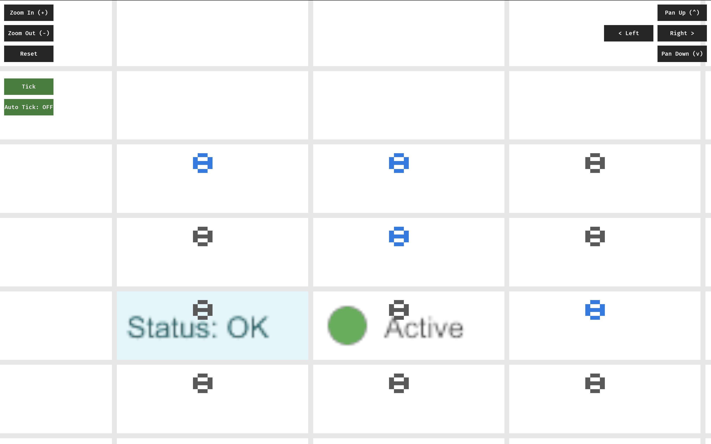
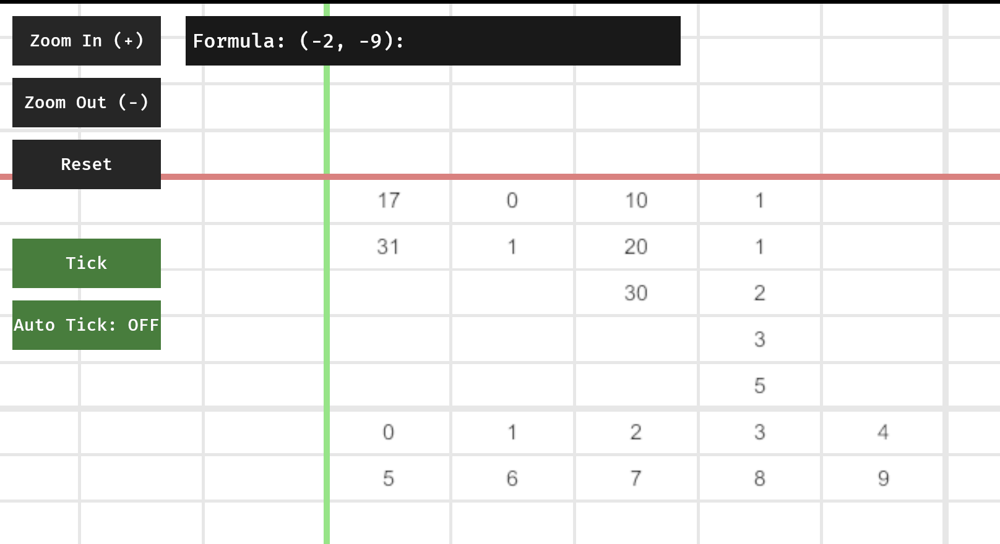
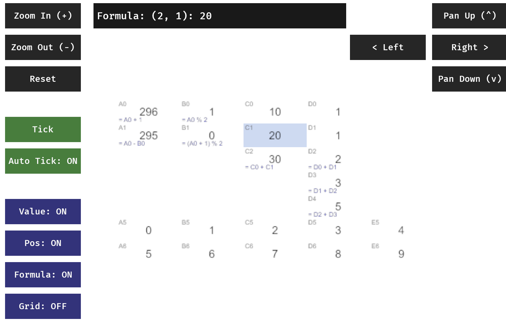

(If you haven't already, check out my [Day -1 post](/blog/langjam-gamejam/day_-1) for context on this project!)

# LangJam GameJam 2025: Day 1

Things went okay today! I learned a lot about rendering -- specifically, combining pipelines in an efficient way -- but I had much less time to work on it today.

This blog post will be briefer because I am very sleepy.

Here is the aforementioned castle: [Schloss Lichtenstein](https://en.wikipedia.org/wiki/Lichtenstein_Castle_(W%C3%BCrttemberg)). 

Beautiful.

Poor connection.

## Milestones

#### Rendering SVGs ([c11fc8b](https://github.com/gcrois/gregsheet/commit/c11fc8b895a3d7d2469088c837df43f50b01e083))


Originally, I had ambitiously planned to use Blitz, an HTML renderer, to render arbtirary HTML/CSS content into my grid cells.

However, after letting an AI wrestle with this task for long enough, I realized that this was perhaps overambitious: Blitz is really designed to render an entire webpage, not tiny snippets of HTML inside a larger rendering context.

Instead, I decided to use [usvg](https://docs.rs/usvg/latest/usvg/), [resvg](https://docs.rs/resvg/latest/resvg/) and [tiny-skia](https://docs.rs/tiny-skia/latest/tiny_skia/) to render SVGs into a buffer I can share with the shader. I'm also using a basic pixel cache to make performance tolerable.

At this point, I officially retired by tiny hexadecimal digit renderer, instead opting to use SVGs to render cell values.

#### Editing cells ([5de8ae0](https://github.com/gcrois/gregsheet/commit/5de8ae0aa55ce63c525322eacf3fe8bb9d18f1d4))


Next, I made things interactive in a very basic way: I can now modify the contents of a single selected cell.

This is currently implemented [extremely naively](https://github.com/gcrois/gregsheet/blob/5de8ae0aa55ce63c525322eacf3fe8bb9d18f1d4/src/main.rs#L602-L651), but it's enough to play with things in real-time. Thinking through this, I fear I may need to add yet another dependency to handle text input properly -- and I may need to look beyond the [Bevy Ecosystem](https://github.com/bevyengine/bevy/issues/12109) for that. Right now, I'm most seriously considering [bevy_egui](https://github.com/vladbat00/bevy_egui), at the risk of my rendering pipeline becoming comically layered: (egui -> bevy -> resvg -> tiny-skia -> wgsl).

At this stage, I was just rendering the computed value of each cell, so there was no way to look at a formula without selecting a cell. This inspired me to implement lenses.

#### Lenses ([5de8ae0](https://github.com/gcrois/gregsheet/commit/5de8ae0aa55ce63c525322eacf3fe8bb9d18f1d4))


Lenses are a very simple way of selecting what parts of a cell should be rendered.

```rust
fn generate_svg(cell: &crate::cell::Cell, col: i32, row: i32, lens_state: &LensState) -> String {
    let mut elements = String::new();

    // 1. Base Content (Value or Rich)
    let is_rich = (col == 0 && row == 2) || (col == 1 && row == 2);
    
    if is_rich && lens_state.show_value {
        // Use custom SVG body for rich cells
        if col == 0 && row == 2 {
            elements.push_str(r##"<rect width="80" height="30" fill="#e0f7fa"/><text x="5" y="20" font-family="sans-serif" font-size="12" fill="#006064">Status: OK</text>"##);
        } else if col == 1 && row == 2 {
            elements.push_str(r##"<circle cx="15" cy="15" r="8" fill="#4caf50"/><text x="30" y="20" font-family="sans-serif" font-size="12" fill="#333">Active</text>"##);
        }
    } else if lens_state.show_value {
        // Default text rendering
        let text = match &cell.value {
            evalexpr::Value::Int(i) => i.to_string(),
            evalexpr::Value::Float(f) => format!("{:.2}", f),
            evalexpr::Value::String(s) => s.clone(),
            evalexpr::Value::Boolean(b) => b.to_string(),
            evalexpr::Value::Empty => "".to_string(),
            evalexpr::Value::Tuple(_) => "Tuple".to_string(),
        };
        elements.push_str(&format!(r##"<text x="40" y="20" font-family="sans-serif" font-size="14" fill="black" text-anchor="middle">{}</text>"##, text));
    }

    // 2. Position Lens
    if lens_state.show_position {
        let coord_text = crate::formula::coord_to_name(col, row);
        // Top-left, small light gray
        elements.push_str(&format!(r##"<text x="2" y="8" font-family="sans-serif" font-size="8" fill="#aaaaaa">{}</text>"##, coord_text));
    }

    // 3. Formula Lens
    if lens_state.show_formula && cell.is_formula {
        // Bottom, small blue
        let formula = cell.raw.replace("<", "<").replace(">", ">").replace("&", "&");
        elements.push_str(&format!(r##"<text x="2" y="28" font-family="sans-serif" font-size="8" fill="blue">{}</text>"##, formula));
    }

    format!(r##"<svg xmlns="http://www.w3.org/2000/svg" width="80" height="30">{}</svg>"##, elements)
}
```

I want to make this more dynamic soon, as I can imagine some really cool interactions with a system that changes how it is being rendered during runtime, but these static lenses will be good for now.

A simple model could be something like this:
```js
{
    value: 10,
    render: (v) => `<text>${v}</text>`,
}
```

But I want the language to be ergonomic... Maybe a good use for the lenses editing a dimension instead of using a dictionary?

#### Small, notable fixes
- Moved to a sparse representation of the grid
- Added colors, tracking lines to the axis
- Made grid toggleable

## What's in store for tomorrow

I'm being heckled by some rabble to actually build the fun parts of a language.


(A message from an [anonymous reader](https://austinhenley.com/))

I feel like I've been using a little too much AI so far, and like many of my colleagues, am beginning to fear the reliance I have on GitHub Copilot.

Tomorrow, I am challenging myself to channel my PL energy, and build a simple language by hand tomorrow, sans all AI assistance. I'm considering shedding the Excel coordinate system, and certainly want to add better support for dynamic references. I want to also think through ranges, and using them as a dictionary of context.

I know I keep saying that I want to build the actual game, but, this time I really mean it. I can at least get the Game of Life tomorrow... right?

(Spoiler: I only kinda did it on [Day 2](/blog/langjam-gamejam/day_2))